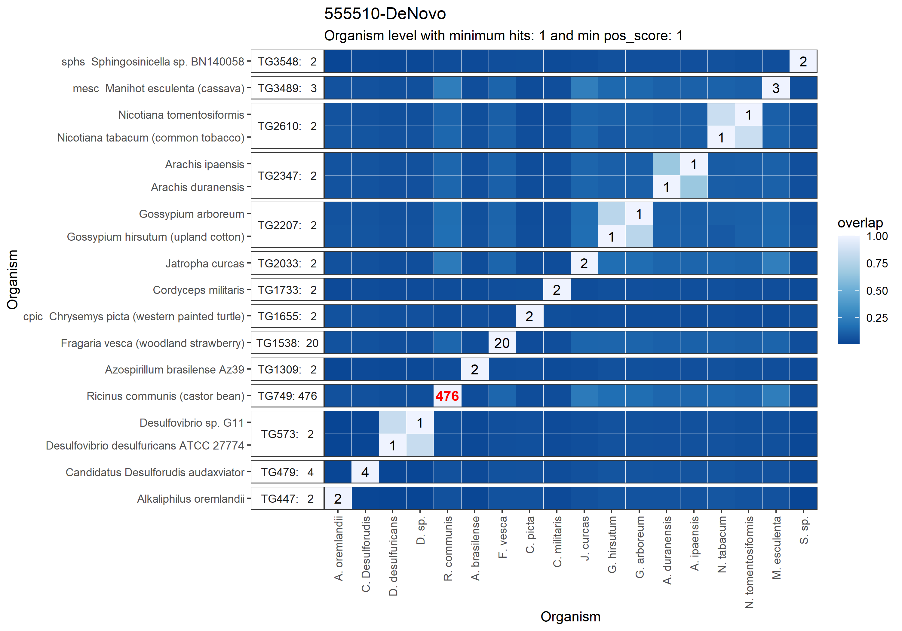
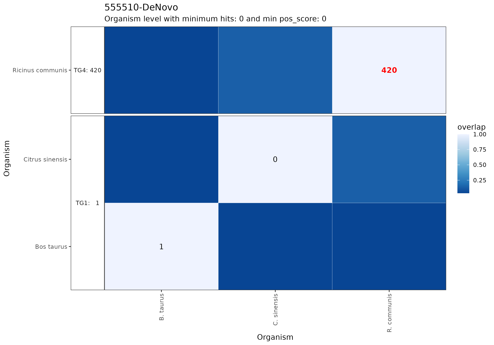

```{r setup, include=FALSE}
knitr::opts_chunk$set(echo = FALSE)
library( ggplot2 )

```
# Introduction
Bioterrorism has created a need for the rapid analysis of samples which may contain toxins, viruses, or other deadly agents. Mass Spectrometry (MS) provides a tool for use in proteomics for accurate and comprehensive profiling of proteins. An automated software tool which can search for matches against a proteome database is useful for forensic analysis of samples and an effective countermeasure to Bioterrorist attacks. A software tool called MARLOWE was tested and it worked well but failed to identify organisms of interest such as the toxin, Arbrin, that were missing from the KEGG.JP[@kanehisa2002kegg] database on which it relies. FTP access to KEGG.JP is cost prohibitive. Here we create a database for MARLOWE using public Uniprot.org proteome database [@10.1093/nar/gkaa1100]. By creating a process to update this MARLOWE database, we can ensure that target organism are present and identified correctly.

# Objectives
1. Create R package to parse UniProt FASTA
2. Create a MARLOWE database with UniProt Proteomes

# Methods
Installed MARLOWE on a 32-core, 500GB ram Ubuntu Linux server with MySQL 8.0.31 to host the UniProt candidate database. MARLOWE packages were modified to run correctly on Linux with R version 4.2.1 using RStudio IDE.

The function of MARLOWE was evaluated on the KEGG version and the UniProt version with 8 data files from biological samples including Fish, Milk, Oyster, Juice and Castor bean. MARLOWE was run with the data that has been processed by PEAKS DeNovo assembler to determine the peptides contained in the samples. The organism identified from each MARLOWE run was compared with the actual contents of the sample in order to make a conclusion on performance or improvements needed.

I wrote the parse_fasta.R package to read UniProt proteome FASTA files. The FASTA format for the UniProt database contains the minimum required fields for MARLOWE but is vastly different from the KEGG format. The parse_fasta function examines the file to determine which UniProt header format is in use and applies the appropriate parsing via Regular expressions. 

The KEGG database used the unique kegg_id identifier.  Prefixing "U" in front to the integer taxonID replaced the kegg_id key field for organisms downloaded from UniProt. The KEGG files provide more fields than the UniProt FASTA header so some fields are set to NULL for the UniProt organism data. These include Pathways, Database Links, Module, Brite, Position, and Motif. They are not required for the MARLOWE algorithm.

# Results
I built a minimal "candidate" database with UniProt proteome data for 9 organisms matching those contained in the test samples. Building the database involves downloading and parsing FASTA proteome files, then inserting organism identification into the database along with the amino acid sequences for all proteins and the peptides that result from digesting these proteins with Trypsin. A final step is to upload NCBI taxonomy data for all organisms used to produce the MARLOWE heatmaps. The following shows the contents of the MySQL database to verify organisms have been inserted correctly. The organisms inserted and the quantities of peptides which resulted from the in-silico digestion of proteins are shown. Strong peptides which are present in multiple organisms in a genus is calculated.
```{r table1, echo=FALSE, message=FALSE, warnings=FALSE, results='asis'}

database_query <- data.frame(
  name = c("Bos taurus","Citrus clementina","Citrus sinensis","Crassostrea gigas",
               "Crassostrea virginica","Ricinus communis","Pseudomonas fragi","Salvelinus namaycush","Chlamydia pneumoniae"),
  taxon_id = c(9913,85681,2711,29159,6565,3988,296,8040,83558),
  protein_count = c(23844, 24934, 28128, 25998, 33719, 31219, 4324, 35973, 1052 ),
  peptide_count = c(652649, 586056, 572368, 687216, 876976, 630447, 85668, 696618, 23031),
  strong_peptide_count =c( 554285, 482274, 471745, 624744, 805672, 520219, 76797, 599782, 20258 )
)

# pull sql query results from copy saved instead of hard coded
if (file.exists( "../organisms.csv" ) ) {
    database_query <- read.csv( "../organisms.csv" )
}

# Table showing organisms in candidate SQL database 
knitr::kable(database_query[,-c(1,3,7) ], 
             caption = "Query of Organisms Inserted into the Candidate Database",
             digits = 0) 
```

MARLOWE identified 7 out of 8 samples using both KEGG and UniProt. Both databases were not able to identify 555558-DeNovo which may point to an issue in the sample. MARLOWE outputs a HeatMap showing the most likely organisms contained in the sample.

```{r figure1, cho=FALSE, message=FALSE, warnings=FALSE, out.width="100%", fig.cap = "HeatMap Generated by MARLOWE with KEGG DB showing it correctly identified R. communis (castor bean) in the sample with score 303 strong peptides."}
  
```
As expected, the KEGG HeatMap shows more candidate organisms.  The KEGG database contains 5,851 organisms and almost 274 million peptides.
```{r figure2, cho=FALSE, message=FALSE, warnings=FALSE, out.width="100%", fig.cap = "HeatMap Generated by MARLOWE with UniProt DB showing it correctly identified R. communis (castor bean) in the sample with score 420 strong peptides."}
  
```
The score for each test sample is shown in Figure 3. The contents of the sample was correctly identified in 7 out of 8 samples. Additionally, in the Fish sample,
P. fragi bacteria was found, indicating spoilage. In the Juice sample, 2 orange species were detected.
```{r figure3, echo=FALSE, message=FALSE, warnings=FALSE, out.width="100%", fig.cap="Results from MARLOWE with 8 samples" }

table_results <- data.frame( 
  Sample=c("R. communis 9","R. communis GC4","555510-DeNovo","555558-DeNovo",
           "Fish-DeNove","Juice-DeNovo","Milk-DeNovo","Oyster-DeNovo",
           "R. communis 9","R. communis GC4","555510-DeNovo","555558-DeNovo",
           "Fish-DeNove","Juice-DeNovo","Milk-DeNovo","Oyster-DeNovo"),
  DB=c("UniProt","UniProt","UniProt","UniProt","UniProt","UniProt","UniProt","UniProt",
             "KEGG","KEGG","KEGG","KEGG","KEGG","KEGG","KEGG","KEGG"),
  Score=c(164,654,420,2,330,192,432,714,#UniProt scores
          111,476,303,0,16,423,109,306) #KEGG scores
  
  )

# Table of Results 
# knitr::kable(table_results,
#              caption = "Comparing Results from UniProt and KEGG", 
#              digits = 0) 

# HOOD_gray <- "#a39994"
# HOOD_blue <- "#30608b"

plot_results <- ggplot( table_results) +  
          geom_bar( 
            aes( fill = DB, x = Sample, y = Score, group = DB ),
            position="dodge", stat = "identity"
          ) +
          geom_text(
            aes(  x = Sample, y = Score, label = Score, group = DB), 
            hjust = -0.5, size = 3,
            position = position_dodge( width = 1 ),
            inherit.aes = TRUE
          ) +
          labs( x = "Sample", y = "HIT Score") +
          ggtitle( "MARLOWE Hit Scores UniProt vs KEGG") +
          scale_fill_manual( values = c( "#a39994", "#30608b" )) +
          theme(axis.text.x = element_text(angle = 90, vjust = 0.5, hjust=1)) +
          coord_flip()

plot_results

```
# Next Steps

We will need to improve the speed of the database building process using parallel computing and multiple servers. The time required to build the sample database on with 9 organisms was about 24 hours. 
Building a fully functional database will require 10,000-22,000 organisms.

Converting the program to run in batch from the Linux shell would be more efficient and less error prone than using RStudio interactively. Parameters can be specified in the command line.

Currently MARLOWE only supports Trypsin protease. We can construct another version of the database where the proteins have been digested with an alternate protease.

# Conclusion
This project was a proof of concept to validate the parse_fasta package and the process for building a UniProt sourced candidate database.
It has produced accurate and expected results with the test cases. 
```{r, include=FALSE}
knitr::write_bib(c('knitr','rmarkdown','posterdown','pagedown'), 'packages.bib')
```
# References
