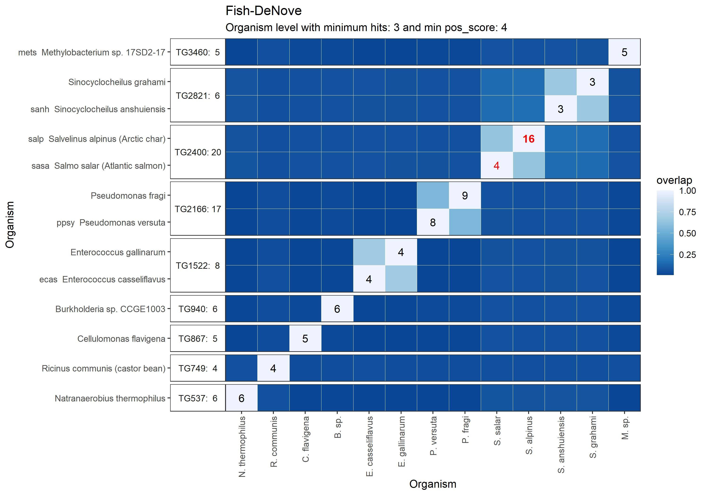
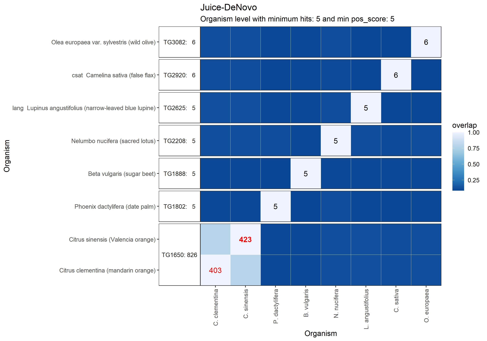

\chapter{Introduction}
\section{Bioterrorism}
Bioterrorism is the use of microorganisms or toxins by terrorist or extremists' groups to produce weapons which cause death and disease [@jansen2014biological]. The use of biological agents (Bioweapons) to cause harm or death is not a new concept; countries have been engaging in bioterrorism for hundreds of years. Infectious diseases were recognized for their potential impact on people and armies as early as 600 BC. The crude use of filth and cadavers, animal carcasses, and contagion had devastating effects and weakened the enemy. Polluting wells and other sources of water of the opposing army was a common strategy that continued to be used through the many European wars, during the American Civil War, and even into the 20th century [@riedel2004biological]. More recently, an attack using anthrax-laden letters mailed to media organizations and politicians [@pal2017overview]. Progress made in biotechnology and biochemistry has simplified the development and production of such biological weapons [@riedel2004biological], thus it is predicted that proliferation of Bioweapons will increase in the next decades. Bacterial and plant protein toxins are among the most powerful poisons known and are considered as potential agents used for bioterrorism and warfare [@duracova2018proteomic]. Biodefense strategies which include early and accurate threat detection are essential in mounting a successful response to bioterrorism. 

\section{Mass Spectrometry}
Mass spectrometry (MS) can be utilized in all stages of such a response: from Bioweapon detectors to accurate forensics classification for successful prosecution [@demirev2008mass]. MS is currently the most comprehensive method for the quantification of proteins [@sinha2020beginner]. It provides a valuable tool for law enforcements' forensic sample analysis. The accuracy of MS can also distinguish between similar compounds and organisms such as the castor bean vs the derrivative toxin Ricin. Current methods, involving manual database searches, are slow, and depend on expert knowledge. Automated solutions produce effective results for non-experts and narrow the search field for experts to perform more in-depth analysis. We must refine software and methods, improving accuracy and efficiency to combat the Bioweapon threat.

\section{Bottom-up Proteomics}
Here we focus on bottom-up proteomics where proteins are digested into smaller peptides, which are analyzed by MS. MS detect the presence and quantity of peptides using properties of mass and net-charge. Mass spectrometers can only analyze gaseous ions, therefore peptides are converted into peptide ions which are separated by their mass-to-charge ratio (m/z).

Samples are prepared for MS by digesting the long polypeptide chains using protease enzymes such as Trypsin, Chymotrypsin or Pepsin. These break proteins into smaller peptides which can be measured by MS. Protease digestion acts to normalize and compartmentalize the biochemical heterogeneity of proteins within a sample as peptides and may create a less heterogeneous mixture when protein splice isoforms and post-translational modifications are considered [@zhang2013protein]. One consideration due to the sensitivity of the MS analysis is that contaminant proteins will appear from Trypsin and human interaction and must be removed from analysis.  Contaminants include human skin or animal proteins from the digesting enzyme.

\section{Bioinformatics Analysis}
Bioinformatics analysis of MS output involves comparing matching the spectral output data from a sample with the theoretical spectra predicted from known genome or amino acid sequences contained in databases [@pere2020hood].  Amino Acid (AA) sequences  of the peptides are determined  using PEAKS® or Novor de-novo sequencing software. The MARLOWE software tool, developed at the Pacific Northwest National Lab (PNNL), to automate this database searching, producing a list of potential candidate compounds or organisms and likelihood scores for each candidate. MARLOWE is an R-Markdown application where the user adjusts a few input parameters to control sensitivity and set sample data input file names. It then performs analysis and generates documents to show the candidate scoring. In testing the MARLOWE search with a sample of the toxin, abrin, no matches were found as this compound was missing from the database.

We will rebuild the MARLOWE analysis software database from UniProt, a publicly available data source. The new database will be generated via in-silico digestion of Amino Acid sequences found in UniProt, using Trypsin. This will result in more accurate and updated searches. The MARLOWE database can be updated, at no cost as more samples are added to UniProt. We will evaluate the success and propose a method to process lab samples digested with enzymes Chymotrypsin or Pepsin [@dau2020proteomics].

\chapter{Literature Review and Previous work}
\section{MARLOWE software tool}
MARLOWE compares these peptides to a MySQL database which has been constructed from the Japanese KEGG.JP protein database [@kanehisa2002kegg]. The construction of the database requires taking the long amino acid sequences from each organism and digesting in-silico using an R subroutine, into smaller peptide sequences that match the digested lab sample. MARLOWE then uses an algorithm which compares the MS/PEAKS® data with the database peptides and makes a list of candidate organisms that may be contained in the sample. It produces scores and a heat map showing the most likely hits.

\section{MARLOWE algorithm}
Protein sequences are taken from the public organism database and digested in-silico to produce peptide sequences. For Trypsin digest, there are specific cut points where the sequences will be split. The peptides are than analyzed against those from other organisms and strong-peptides are tagged. These have more value to the search algorithm due to factors such as the quantity present in one organism versus another. Organism protein sequences, peptides, and strong-peptides are inserted into the local SQL database for use in analysis by the MARLOWE algorithm.

\chapter{Specific Aims}
\section{Aim 1 Create R package to parse UniProt FASTA}
Aim 1 is to create a new R package which will extract required fields from publicly available UniProt data [\@10.1093/nar/gkaa1100] in fasta format. A major weakness of the MARLOWE tool is that the database was built using protein data from KEGG.JP, more than 2 years ago. The database cannot be updated without a paid subscription to the KEGG.JP FTP site which costs \$25,000 per year for a single site license. The KEGG data extraction subroutines in MARLOWE rely on regular expression to parse human readable .ent files from KEGG.JP. The .ent files are not standard so these subroutines are not useful for any other sources [@csordas2012pride]. The fasta format is a standard so the R data extraction package will be adaptable to UniProt or other protein databases where fasta output is available. Successful adoption of the UniProt data will make MARLOWE cheaper and more accessible for use as licensed access to the KEGG.JP FTP site is no longer required.

I created a new UniProt based peptide database by downloading data from Uniprot's uniref50 in fasta format and parsed it via the parse_fasta package to extract the data fields that MARLOWE requires. Creating the MARLOWE database from complete uniref50 data is a computationally intense process taking weeks on a powerful workstation or server. There are over 100,000 organisms. By extracting this data into a separate file for each, I can develop a faster method to create the database using parallel processing on an NBACC High Performance Computing (HPC) cluster. I have ported the MARLOWE code and database from Windows to Linux to make this possible.

\section{Aim 2 Create a MARLOWE database with UniProt Proteomes}
Aim 2 is to improve the accuracy and performance of the MARLOWE tool by updating the database with new samples and creating an efficient process to update the database as needed. When NBACC scientists tried to perform an analysis of a sample containing the toxin "abrin", the program did not identify abrin because the database was out of date and did not contain entries for abrin. These were added to the KEGG.JP database in the year after MARLOWE was created. Abrin protein sequences are currently contained in both UniProt and KEGG.JP protein databases. These databases are updated constantly with protein sequences, often in response to a new toxin or virus of interest. Addition of the latest entries from UniProt will improve the accuracy of the MARLOWE pipeline, increasing the chance to identify the candidate toxin without manual searching.

Aim 2. I will download subsets from UniProt by using queries which will contain the compounds in the test samples, milk, abrin, and castor bean. I will then compare the resulting MARLOWE/UniProt analysis to that done with the MARLOWE/KEGG to validate the sample was found and compare the scoring. This will lead to a process which can be used to update the database as needed, in the future. As more entries are added to UniProt or other protein databases are identified, this process can be repeated. After validation of the extraction and database creation, we can develop a repeatable procedure to download the entire UniProt database. Additionally, if I can obtain access to the current KEGG.JP FTP site, I will create an updated MARLOWE/KEGG database to validate that "abrin" can now be located using the original MARLOWE code.

\chapter{Resources, Tools, and Research Methodology}
\section{Hardware and Software Versions}
I installed MARLOWE on a server with a 32-core AMD cpu and 500G ram.   The storage for the database was a high speed NVME SSD. The Operating System was Ubuntu 20.04LTS .I have also installed it on a workstation with 18-core Intel cpu and 256G ram. The workstation's operating system is Windows 10. MARLOWE was designed to run with Microsoft Windows® but I have converted it to run on Linux so that I may use HPC resources. I will test it on Ubuntu 20.04LTS and CentOS 7. The conversion to Linux involved replacing some of the R packages used for File selection with code that will work on Linux. The KEGG database mysqldump (backup file) had to be edited to change some of the collation utf8mb4_0900_ai_ci used by MySQL 8.0 which is not supported by MariaDB. It was replace by collation utf8mb4_unicode_520_ci. This collation works on MySQL 8.0.31-0ubuntu0.20.04.1.

I loaded the MARLOWE source packages into a GitHub.com repo so I can create new packages which can be tested on various Linux platforms. The code is written with R version 4.2.1 using the RStudio Development Environment and a database from UniProt data will be created with MySQL version 8.0.31 for Ubuntu Linux and MariaDB 5.5 for CentOS 7 Linux. Collation utf8mb4_unicode_520_ci is not supported on MariaDB 5.5. 

I validated the output of MARLOWE (current version MySQL 8.0 on Windows 10, R version 3.6.1 ) with 8 data files from biological samples including Fish, Milk, Oyster, Juice and Castor bean. To perform the analysis of the two databases, MARLOWE was run against each database with the same samples. The output from each was compared with the actual contents of the sample in order to make a conclusion on performance or improvements needed.

\section{R packages Developed for Parsing FASTA files}
The FASTA format for the UniProt database contains the minimum required fields for MARLOWE but must be parsed differently since it is vastly different from the KEGG .ent format which is more suited for human readers. There are in fact different FASTA header formats used by UniProt Uniref and UniProtKB. The UniProt Proteome FASTA files use the UniProtKB format. I wrote a parse_fasta R function, which examines the file to determine which header format is in use and applies the appropriate parsing via Regular expressions. Here is an example of the fields extracted from the proteome FASTA headers that were used for the organisms inserted into the database.  UniProt identifies organisms with NCBI taxonID (OX). The KEGG database used the unique kegg_id identfier.  For our purpose, I am prefixing "U" in front to the integer taxonID to replace the kegg_id for organisms downloaded from UniProt. In the example below, R. communis taxonID = 3988 so the kegg_id = U3988 when inserted into the candidate database. The KEGG .ent files provided more fields than are available in the header so many fields are set to NULL for the UniProt derived organism data. These include Pathways, Database Links, Module, Brite, Position, and Motif. They are not required for the MARLOWE algorithm.

### UniProt Release 2022_04 ###

\scriptsize
```
UniProtKB Fasta header format
  
  These files, composed of canonical and additional sequences, are non-redundant
  FASTA sets for the sequences of each reference proteome.

  For further references about the standard UniProtKB format, please see:
   http://www.uniprot.org/help/fasta-headers
   http://www.uniprot.org/faq/38
  
 >db|UniqueIdentifier|EntryName ProteinName OS=OrganismName OX=OrganismIdentifier [GN=GeneName ]PE=ProteinExistence SV=SequenceVersion
  
 Example from the R. communis Proteome FASTA file of headers used for 5 protein sequences
  
 >tr|B9R7K7|B9R7K7_RICCO Cytochrome P450 OS=Ricinus communis OX=3988 GN=RCOM_1592680 PE=3 SV=1
 >tr|B9R8T7|B9R8T7_RICCO Cinnamoyl-CoA reductase, putative OS=Ricinus communis OX=3988 GN=RCOM_1602080 PE=4 SV=1
 >tr|B9R9L1|B9R9L1_RICCO 3-ketoacyl-CoA synthase OS=Ricinus communis OX=3988 GN=RCOM_1498550 PE=3 SV=1
 >tr|B9RAM4|B9RAM4_RICCO 26S proteasome non-atpase regulatory subunit, putative OS=Ricinus communis OX=3988 GN=RCOM_1507340 PE=4 SV=1
 >tr|B9RBT9|B9RBT9_RICCO C-4 methyl sterol oxidase, putative OS=Ricinus communis OX=3988 GN=RCOM_1681040 PE=3 SV=1
```
\normalsize
\chapter{Results}
\section{UniProt candidate database}
I built small "candidate" database with UniProt (Release 2022_04) Proteome data for 9 organisms including those contained in the lab samples that were analysed with Mass Spectrometry. Building the database involves downloading and parsing fasta proteome files, then inserting into the database along with the amino acid sequences for all proteins and the peptides that result from digesting these proteins with Trypsin. A final step is to upload NCBI taxonomy data for all organisms used to produce the MARLOWE heatmaps. The following shows the contents of the MySQL database to verify organisms have been inserted correctly.  As a validation of the success, the following SQL query shows the organisms inserted and they quantities of peptides which resulted from the in-silico digestion. The filtering for strong peptide count can also be verified.

```{r table2, echo=FALSE, message=FALSE, warnings=FALSE, results='asis'}
database <- data.frame(
  name = c("Bos taurus","Citrus clementina","Citrus sinensis","Crassostrea gigas",
               "Crassostrea virginica","Ricinus communis","Pseudomonas fragi","Salvelinus namaycush","Chlamydia pneumoniae"),
  taxon_id = c(9913,85681,2711,29159,6565,3988,296,8040,83558),
  protein_count = c(23844, 24934, 28128, 25998, 33719, 31219, 4324, 35973, 1052 ),
  peptide_count = c(652649, 586056, 572368, 687216, 876976, 630447, 85668, 696618, 23031),
  strong_peptide_count =c( 554285, 482274, 471745, 624744, 805672, 520219, 76797, 599782, 20258 )
)

# Table of Results 
knitr::kable(database,
             caption = "Query of Organisms Inserted into the Candidate Database",
             digits = 0)

```

I ran the MARLOWE software with PEAKS output from 8 datasets which contained organism that are in the database. Ricinus communis was contained in 4 of the samples and the other 4 were random samples created for testing to include milk, orange juice, oyster, and fish. MARLOWE was able to detect the sample with a strong signal score for 7 of the tests.

Poor results where evident in 555558-DeNovo, a R. communis sample, where B. taurus (4) and S. namaycush (3) both scored slightly higher than R. communis (2). However these low scores are all below the threshold for detection. In the Orange Juice sample, the 2 Citrus organisms scored high, (130, 62) but there was also a presence of R. communis (28) detected. Heatmaps produced as the final output by MARLOWE clearly show the presence of the organisms contained in each sample.
Comparison with KEGG output for Sample 555558-DeNovo will indicate if there is an issue with this data.
  
```{r table3, echo=FALSE, message=FALSE, warnings=FALSE, results='asis'}
## add code to read these from .csv files that will be saved with the document.
## use an R SQL query to generate these files if possible.

results <- data.frame( 
  Sample=c("R. communis 9","R. communis GC4","55551-DeNovo","555558-DeNovo",
           "Fish-DeNove","Juice-DeNovo","Milk-DeNovo","Oyster-DeNovo"),
  UniProt=c(164,654,420,2,330,130,432,714),
  KEGG=c(111,476,303,0,16,423,109,306),
  Next_UniProt=c("1","1","1","3","302*","62**","4","10")
  
  )

# pull sql query results from copy saved instead of hard coded
if (file.exists( "organisms.csv" ) ) {
    results <- read.csv( "organisms.csv" )
}
# Table of Results 
knitr::kable(results,
             caption = "Comparing Results from UniProt and KEGG",
             digits = 0)
```
\scriptsize
```
*  Score 302 was for P. fragi bacteria which indicates spoilage.
** Score 62 was for another orange detected since the orange juice was a blend of 2 oranges.
```
\normalsize

The performance with UniProt data shows that the database creation is working for this small set of organisms.  The KEGG database has more than 5,000 organisms.  There are approximately 22,000 reference Proteomes on UniProt.  We will create a more complete database with 5,000 to 20,000 UniProt Proteome for a fully functioning MARLOWE.

\section{Discussion}
The process to build the database appears to be working but it is very slow on my test with a single server.
There are 2 main steps: 1. Convert the UniProt proteome fasta files into RData and 2. Import a directory fill of these Rdata files into MySQL.

While I try to speed up this process, we could be converting the 22,000 UniProt Proteome into RData files. We could also select a subset of Proteomes.
The proteome fasta are organized in the groups [ Archaea, Bacteria,Eukaryota,Viruses] so that we could convert Virus, Bacteria, etc but not convert some other groups.
We could also select organisms based on taxonomy or other attributes.  If I have a list of organisms to be inserted into the database, I can convert these first.

\chapter{Summary and Future Work}

\section{Alternate digestion enzyme}

Currently MARLOWE only supports Trypsin digest. We can construct another version of the database where the peptides have been digested with an alternate protease enzyme.

\section{Efficiency Improvements}

The time required to build the sample database was about 24 hours with 9 organisms.  We will need to improve the speed of this process using parallel computing and multiple servers in order to create the database.  Exploring faster algorithms may also lead to improvements.

\section{User Interface Improvements}
GUI interface would be possible by creating an R-Shiny version where the scientist could select their input files using a GUI and then the pipeline would run automatically and produce and output report that could be viewed and downloaded. Automated database updates via API would allow adding new organisms to the database by pulling from UniProt via API and inserting into the MARLOWE candidate databases.

\chapter{Figures}
{width=65%}

{width=65%}

\newpage
{width=65%}

{width=65%}

\newpage
{width=65%}

{width=65%}

\newpage
Ricin Prep Sample that was not found in KEGG or UniProt

{width=65%}

{width=65%}

\newpage
### Samples Tested which do not contain R. communis ###

Fish

{width=65%}

{width=65%}

\newpage
Orange Juice

{width=65%}

{width=65%}

\newpage
Milk

{width=65%}

{width=65%}

\newpage
Oyster

{width=65%}

{width=65%}

<!-- ### Other Heat Maps Available to replace the KEGG Figures already used ### -->
<!--  -->
<!--  -->
<!--  -->
<!--  -->
<!--  -->
<!--  -->
<!--  -->
<!--  -->
<!--  -->
<!--  -->
<!--  -->
<!--  -->
<!--  -->
<!--  -->
# References {.unnumbered}
